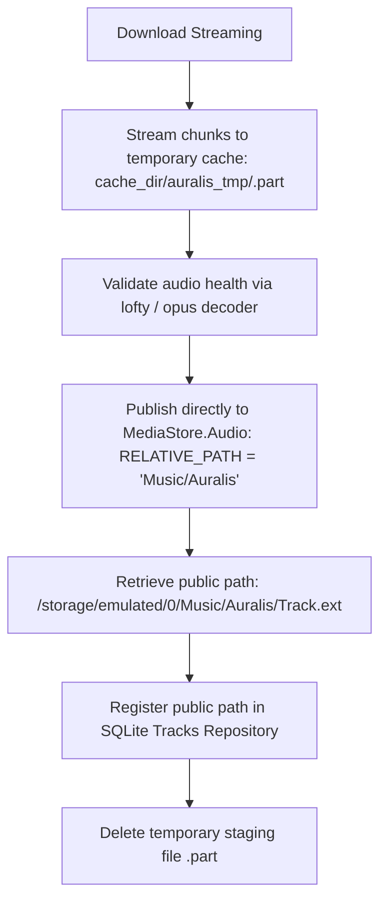

# Android Public Music Storage & Zero-Duplication Download Plan

## 1. Overview & Objectives

Currently, downloaded tracks are saved to internal sandboxed storage (`app_data_dir/downloads`) and dual-saved to the visible `Download/Auralis/` directory.

### Objectives:
1. **Prevent Data Loss on App Uninstall**: Files stored in public storage (`/storage/emulated/0/Music/Auralis/`) persist permanently even if the app is uninstalled or reinstalled.
2. **Eliminate Storage Bloat**: Prevent the app from showing gigabytes of internal storage in Android Settings by avoiding dual-copy retention.
3. **Seamless System Integration**: Output audio directly into the OS `Music/` collection (`MediaStore.Audio.Media`) so it is immediately visible to system media players, file managers, and Android Auto.

---

## 2. Target Architecture

### Flow Diagram:

---

## 3. Implementation Steps

### Phase 1: Update `android_downloads.rs`
- In `publish_q`, change target collection from `MediaStore.Downloads.EXTERNAL_CONTENT_URI` to `MediaStore.Audio.Media.EXTERNAL_CONTENT_URI` (or `MediaStore.VOLUME_EXTERNAL`).
- Set `RELATIVE_PATH` to `"Music/Auralis"`.
- Set `IS_PENDING = 1` while writing bytes, then update `IS_PENDING = 0` upon completion.
- Return the final public canonical path (`/storage/emulated/0/Music/Auralis/<title>.<ext>`).

### Phase 2: Downloader Cleanup & Path Registration (`downloader.rs`)
- On Android, once `publish_to_downloads` succeeds and returns the public path:
  - Set the `Track.file_path` to the public path in the database.
  - Remove the temporary `.part` file from internal cache.
  - Ensure fallback to internal path only if `MediaStore` publishing fails or permissions are denied.

### Phase 3: Player Fallback & MediaStore Sync
- Ensure `AudioPlayer::play` can directly stream from `/storage/emulated/0/Music/Auralis/<file>` without copying.
- Ensure `MediaStoreScanner.kt` queries `Music/Auralis` seamlessly and does not create duplicate entries.

---

## 4. Verification & Testing Checklist
- [ ] Verify download output exists at `/storage/emulated/0/Music/Auralis/<filename>`.
- [ ] Verify `app_data` internal storage in Android Settings remains minimal (~20MB).
- [ ] Verify uninstallation does not delete files in `/storage/emulated/0/Music/Auralis/`.
- [ ] Verify playback starts immediately from the public file path.
